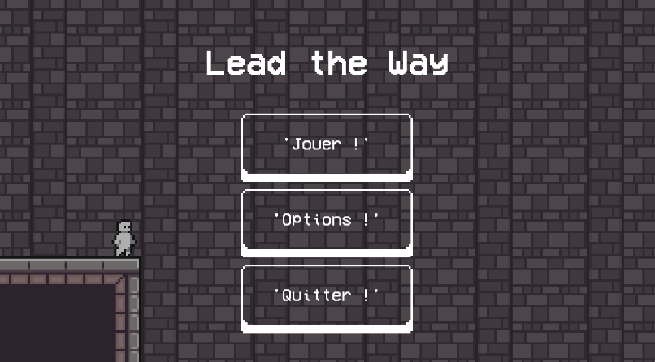
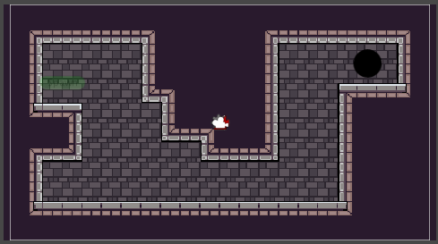
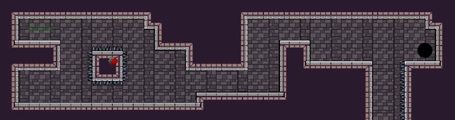

# Lead the Way

Créé dans le cadre d'un projet suivant le thème d'un Alt-CTR Gamejam, Lead the way est un jeu de plateforme utilisant des contrôles vocaux. Prisonnié d'un donjon, le joueur devra dicter des ordres au personnage pour que celui ci puisse en sortir.

Ce projet a été réalisé sous Unity, version 2020.2.3f1.

### Pré-requis pour fonctionner

Pour que la reconnaissance vocale fonctionne il faut :
- Windows 10 avec Cortana d'activé
- Un microphone

## Contenu du Projet 

Le projet contient tous les fichiers Unity du jeu. À savoir :

Les différents scripts C# (.cs) :
- EndLevel : une seule fonction qui est un trigger. Ce déclenche lorsque le personnage entre dans la collision associée et provoque la fin du niveau.
- LevelButton : Script lié au boutton de choix de niveau dans le menu principal. Attention, les bouttons ne fonctionnent pas par clique mais par commande vocale ('Niveau 5' par exemple).
- LevelManager : Tout ce qui est relatif à la gestion d'un niveau, donc le nom du niveau et celui du prochain niveau y sont renseignés, la position où spawn le personnage, etc... C'est un singleton (présent qu'une seule fois par scène).
- MainMenu : Definition des fonctions relatifs au menu principal, gestion des panneaux (principal et des niveaux), et de quitter le jeu, ...
- MovablePlateform : Plateforme qui bouge entre 2 points.
- Player Controller : tous les contrôles (commandes vocales) et fonctions (movement, mort, ...) relatif au personnage. 
- Room : Une room est un espace associé à une caméra qui est active lorsque le personnage se retrouve dans son espace.
- UIController : Tout l'UI est controllé par ce script. Il permet aussi de définir les commandes vocales liées à l'UI (pause, son, etc...)
- UserInterfaceAudio : Tous les sons et musiques présents dans les niveaux (donc pas le menu principal) sont contrôlés depuis ce script.

Les différents assets graphiques qui proviennent de différents projets personnels antérieurs.

Et les sons et la musique, qui eux proviennent des packages [8-Bit Sfx](https://assetstore.unity.com/packages/audio/sound-fx/8-bit-sfx-32831) et [8-bit music free](https://assetstore.unity.com/packages/audio/music/electronic/8-bit-music-free-136967).


## Devlog

**Titre :**   Lead the Way <br />
**Début du projet :** 30/04/2021 <br />
**Fin du projet :** 10/05/2021

### Préambule : idée de base

J'affectionne beaucoup les jeux de plateforme parce que très simple dans les mécaniques et pourtant propose un défi très relevé au joueur. dans ce type de jeu, je peux citer par exemple Celeste, Hollow Knight ou encore Super Meat Boy.

Ainsi, l'idée de départ : faire un jeu de plateforme. Mais avec quel controller ? Là était la difficulté, utiliser autre chose qu'un clavier ou une manette pour contrôler le personnage, tout en gardant une certaine cohérence avec le jeu et sans enlever le défi : Des commandes vocales ! Nous n'incarnons pas le personnage mais nous lui donnons des ordres. Le seul point est d'adapter le GamePlay avec la latence du à la reconnaissance des commandes.


### Devlog - 1 : Niveau test et premiers contrôles vocaux


##### Implémentation des contrôles vocaux : Windows.Speech

Tout d'abord, pour reconnaître les commandes, nous avons besoin de quelques instructions d'utilisations :
- System pour utiliser les Actions
- System.Linq pour les Dictionnaires
- Windows.Speech pour utiliser l'assistant personnel de Windows : **Cortana**

```bash
using System;
using System.Linq;
using UnityEngine.Windows.Speech;
```

Ensuite nous initialisons un Dictionnaire d'Actions avec comme clés les commandes vocales, et le module de reconnaissance vocale.

```bash
Dictionary<string, Action> keywordActions = new Dictionary<string, Action>();
KeywordRecognizer keywordRecognizer;
```

Dans la fonction Start de nous définissons nos différents éléments du dictionnaire.

```bash
keywordActions.Add("Start", StartMoving);
keywordActions.Add("Stop", StopMoving);
keywordActions.Add("Droite", MoveRight);
keywordActions.Add("Gauche", MoveLeft);
keywordActions.Add("Hop", Jump);
```

À la suite, nous créons le Keyword Recognizer en précisant ce que l'on veut reconnaître et le niveau de confiance de la reconnaissance (ici low pour reconnaître un maximum de mot venant du joueur plutôt que d'avoir des ordres non reconnus et non éxecutés).

```bash
keywordRecognizer = new KeywordRecognizer(keywordActions.Keys.ToArray(), ConfidenceLevel.Low);
keywordRecognizer.OnPhraseRecognized += OnKeywordRecognizer;
keywordRecognizer.Start();
```

Puis, nous associons la méthode OnKeywordRecognizer à l'event OnPhraseRecognized

```bash
keywordRecognizer.OnPhraseRecognized += OnKeywordRecognizer;
```
Exemple de méthode :

```bash
void OnKeywordRecognizer(PhraseRecognizedEventArgs args)
{
    keywordActions[args.text].Invoke();
}
```

Et enfin, nous commençons la reconnaissance vocale.

```bash
keywordRecognizer.Start();
```

Dans le cas des contrôle du personnage, les contrôles vocaux sont placés dans le script [Player Controller](https://github.com/Arthur-bot/Lead-the-way/blob/main/Lead%20the%20Way/Assets/Script/PlayerController.cs).

Chaque Action associée dans le dictionary<string, Action> définie une action précise comme les changemets de direction, les sauts, ...
Par exemple :

```bash
    void Jump()
    {
        if (isGrounded)
        {
            rb.velocity = new Vector2(rb.velocity.x, jumpForce);
        }
        else if (wallSliding)
        {
            if (isFacingWall)
                wallJumpingFace = true;
            else
                wallJumping = true;

            Invoke("SetWallJumpingFalse", wallJumpTime);
        }
    }
```

De plus, le script est associé au prefab personnage. Ainsi, à chaque fois que l'un des personnage est détruit, le keyword recognizer qui lui était associé l'est aussi et un nouveau est initialisé après le respawn du personnage.

##### Niveau test

Maintenant que les contrôles sont créés, il ne reste plus qu'une scène pour les tester 



Dans cette scène on voit une étiquette verte 'spawn', d'où le personnage part au début du niveau et où il reapparait après chaque mort, un cercle noir représentant la sortie du niveau et un chemin clair pour y accéder, nous faisant utiliser chaque actions codées précedemment.

Et voila, après quelques petites heures, une première scène test avec un personnage pouvant bouger, sauter, mourir et le tout contrôler par la voix. Aucune animation, pas de menu, de son ou autre mais un personnage qui nous obéi et c'est pas mal.

### Devlog - 2 : Nouveau niveau et enchainement entre les niveaux

Un seul niveau pour un jeu de plateforme, ... c'est un peu court. Donc cette fois-ci, j'ai créé un nouveau niveau très original (j'ai simplement copié-collé le premier niveau de test... :D) et j'ai relié le tout : lorsque l'on arrive à la fin du 1er niveau, on charge le 2ème. Et inversement lorsque l'on finie le 2ème, on retombe dans le premier.

On rajoute une petite animation en guise de transition et le tour est joué.


### Devlog - 3 : Création d'un menu avec contrôles vocaux

Le jeu en entier doit pouvoir se jouer sans souris ni clavier, il faut donc créer un menu qui puisse être contrôlé par des commandes vocales de la même manière que le personnage. (cf le script [Main Menu](https://github.com/Arthur-bot/Lead-the-way/blob/main/Lead%20the%20Way/Assets/Script/MainMenu.cs)).

Rebelote, ajout d'un nouveau keyword Recognizer spécifique au menu (les commandes étant inutiles et/ou différentes dans les niveaux, ce script n'est présent que dans la scène "Main Menu").

```bash
keywordActions.Add("Jouer", ShowLevelSelection);
keywordActions.Add("Musique", Music);
keywordActions.Add("Menu", GoBack);
keywordActions.Add("Quitte", LeaveGame);
```

Le menu est composé de 2 pages : 
- la page principale avec les différentes options (Jouer, Musique(On/Off), et Quitter)
- la page des niveaux (allant de 1 à 10). Dans celle-ci, les niveaux débloqués ou non sont diffénrenciés par leur sprite.

Ensuite, je créé un nouveau keyword Recognizer seuelement pour les niveaux (encore x2) ! Cette fois-ci la commande vocale est définie par une variable (le nom du niveau) 

Pour finir, une nouvelle commande quand je suis dans les niveaux pour pouvoir retourner au menu principal. 

```bash
keywordActions.Add("Menu", GoToMenu);
```

Et voila, maintenant nous avons 2 niveaux, un menu, la capacité de naviguer entre les 3 et quelques commandes vocales. 

### Devlog - 4 : Level Design

Bon, le principal inconvéniant de la reconnaissance vocale est la latence que met le système pour reconnaître chaque commande dite par le joueur, mais aussi (!!) le temps de latence entre chaque commande (le joueur ne peut pas enchaîner 2 commandes, mais doit laisser un espace entre chaque). Ainsi, il faut pouvoir organiser les niveaux de sorte à laisser du temps au joueur de planifier les prochaines actions sans pour autant enlever du challenge.

Les niveaux ont donc été pensé à cet effet en élargissant le sol. Après un court temps d'adaptation à cette latence, le joueur sera tout à fait capable d'enchaîner les difficultés qui lui feront face.

Pour la création des niveaux, je me suis essentiellement inspiré de 3 jeux de plateforme, Celeste, Super Meat Boy et Catbird.

Il y a maintenant 10 niveaux, dont 3 didactiques permettant au joueur d'apprendre les différentes commandes, puis 7 autres avec une courbe de difficulté croissante. Par exemple, respectivement les niveaux 4 et 7.





### Devlog - 5 : Polissage (son, animation UI, ...)

Cette fois, moins de code et plus d'assets :
- Ajout d'assets graphiques pour les niveaux didactiques, ceux-ci permettant d'apprendre les différentes commandes
- Ajout de musiques (une différente pour le menu et les niveaux)
- Ajout de son pour les sauts (lorsque l'on atterri) et à la mort du personnage.
- Ajout d'options pour le son et musique (On/Off) -> ces options sont permanentes entre les niveaux
- Ajout d'un menu 'Pause' dans les niveaux pour régler la musique, le son ou alors pour retourner au menu. Celui-ci fonctionnant par contrôle vocaux, il fallait créer de nouveaux ordres : 

```bash
keywordActions.Add("Pause", PauseGame);
keywordActions.Add("Musique", Music);
keywordActions.Add("Son", Sound);
keywordActions.Add("Menu", GoToMenu);
```

Et voila, un jeu de plateforme en 2D le tout utilisant des commandes vocales comme contrôles. :D

### Devlog - 6 : Pistes d'amélioration

Bon, en soit il y a beaucoup de piste pour améliorer le tout (peut être plus tard...) mais voici une liste non exhaustive :

- Ajouter de nouvelles plateformes (Mac, ios, android, ...). Avec le code actuel, la reconnaissance vocale ne fonctionne que sur Windows 10 (étant obliger de passer par Cortana), cependant on pourrait tout aussi bien passer par d'autres logiciels de reconnaissance vocale pour élargir le nombre de plateformes.
- Ajouter une fonction permettant de capter l'amplitude de la voix, ainsi, en utilisant le commande pour sauter ('Hop'), plus le joueur le dit fort,plus le personnage sautera haut et inversement si le joueur le dit faiblement.
- Ajouter un autre objectif pour apronfondir le gameplay. À la manière des fraises dans Celeste, rajouter un collectionable présent dans certains niveaux pour donner un nouvel objectif au joueur, tout en rajoutant du défi.
- Ajouter d'autres niveaux, avec des architectures différentes et des mécaniques spécifiques à ces niveaux (niveau dans l'espace avec un persnnage ralenti, pouvant sauter plus haut et plus loin pour simuler la différence de gravité, ...)
- Corriger certains bugs comme le personnage qui peut rester bloqué sur un rebord après un saut, ...

## Licence
Le contenu de ce projet est licencié sous la licence GNU GENERAL PUBLIC, sauf si une autre est spécifiée plus haut. Voir [LICENCE file](https://github.com/Arthur-bot/Lead-the-way/blob/main/LICENSE) dans le projet pour plus d'informations. En vrai j'ai pas lu donc c'est du pif :D
